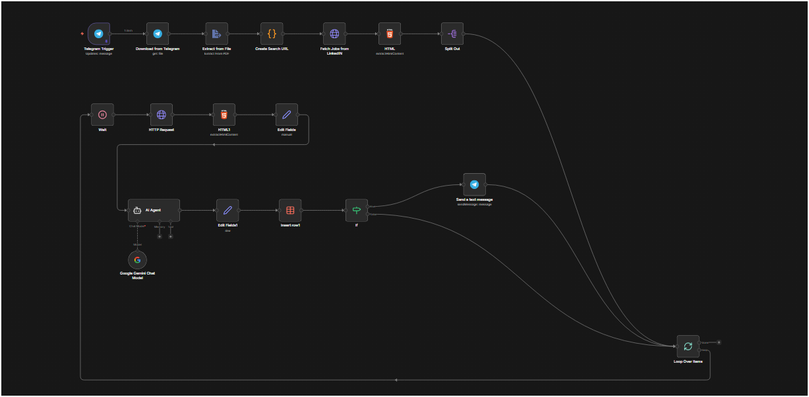

# ⚙️ CareerAgent AI: Autonomous Job Intelligence Engine

**CareerAgent AI** is an intelligent, agentic automation workflow built on **n8n**. It eliminates the manual effort of job searching by autonomously discovering roles, analyzing them against your resume using **Google Gemini (LLM)**, and delivering high-quality leads directly to your Telegram.

## Workflow

## 🚀 How It Works
1. **Trigger:** The workflow is triggered via a Telegram message containing your resume.
2. **Search:** It dynamically generates a LinkedIn search URL for specific roles and locations.
3. **Scrape:** The system scrapes job details (Title, Company, Description) from the search results.
4. **Analysis:** A **Gemini-powered AI Agent** compares your resume against the Job Description to calculate a "Match Score."
5. **Report:** The Agent identifies "Must-Have" vs. "Recommended" skills.
6. **Notify:** If the Match Score is > 50%, it sends a detailed alert with the application link to your Telegram.

## 🛠️ Tech Stack
* **Workflow Automation:** [n8n](https://n8n.io/)
* **AI & LLM:** Google Gemini, LangChain (AI Agent)
* **Scripting:** JavaScript (n8n Code Nodes)
* **Data Handling:** HTML Parsing, PDF Extraction, n8n Data Tables
* **Communication:** Telegram Bot API

## 📋 Features
* **Semantic Matching:** Goes beyond keyword matching to understand the context of your experience.
* **Intelligent Filtering:** Prevents notification fatigue by only sending high-probability opportunities.
* **Skill Gap Identification:** Provides immediate feedback on what skills you might need to highlight or learn for a specific role.
* **Automated Persistence:** Stores all processed job data for later review in an internal database.

## ⚙️ Setup Instructions
1. **Import:** Import the provided `workflow.json` into your n8n instance.
2. **Credentials:** - Connect your **Telegram Bot API** credentials.
   - Connect your **Google Gemini (PaLM/Gemini)** API key.
3. **Configuration:** - In the `Create Search URL` node, update the `roles` and `cities` arrays to match your preferences.
   - Update the `chatId` in the Telegram nodes to your personal Telegram ID.
4. **Deploy:** Set the workflow to **Active**.

## 🤝 Connect with Me
- **Portfolio:** [Sanjeet.dev](https://sanjeetkryadav.github.io/)
- **GitHub:** [@sanjeetkryadav](https://github.com/sanjeetkryadav)
- **LinkedIn:** [in/sanjeet786](https://www.linkedin.com/in/sanjeet786/)
- **Email:** sanjeety00@gmail.com

---
*Developed with ❤️ to automate the boring parts of the job hunt.*
